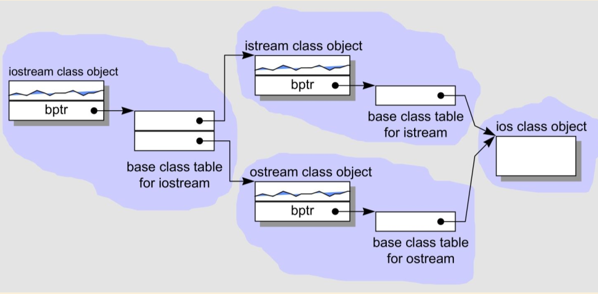

# 1. why operator+ and operator- return value type, however the operator= return the refercence type?
Because the operator+ and operator- will produce the new value and operator= will keep the value so it's
more effective to return reference.  
Generally don't return const value, since it will prevent the move semantic.  
https://stackoverflow.com/questions/21485366/why-we-use-reference-return-in-assignment-operator-overloading-and-not-at-plus-m

# 2. c++ candidate function not viable
non-const reference cant' pass by const reference  
https://stackoverflow.com/questions/35587654/candidate-function-not-viable-expects-an-l-value-for-3rd-argument  
https://stackoverflow.com/questions/62353625/c-candidate-function-not-viable

# 3. c++ *object* layout
data members 直接含在一个class object 中，member function虽然在class声明之内，却不出现在object中。每一个non-inline的member function只有一个函数实例。对于inline来说则每一个使用它的都会有一个函数实例。

```c++
class Point {
public:
    Point(float xval);
    virtual ~Point();
    float x() const;
    static int PointCount();

protected:
    virtual ostream& print(ostream& os) const;
    float _x;
    static int _point_count;
};
```


# 4. inheritance -- single inheritance, multi inheritance, virtual inheritance

```c++
// single inheritance
class Libray_materials { ... };
class Book : public Libray_materials { ... };
class Rental_book : public Book { ... };

// multi inheritance
class iostream : public istream, pulbic ostream { ... };

// virtual inheritance
class istream : virtual public ios { ... };
class ostream : virtual public ios { ... };

```



# 5.  一般需要多大的内存来存储一个class object？

nonstatic data members 的总和大小

alignment所需要的padding空间

virtual 支持的开销

# 6. 虚函数可以是inline的吗

虚函数可以是inline的，只要不是通过指针，引用来确定对象的具体类型。如果编译器已经明确知道了对象类型。