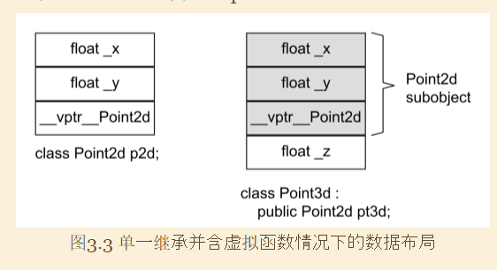
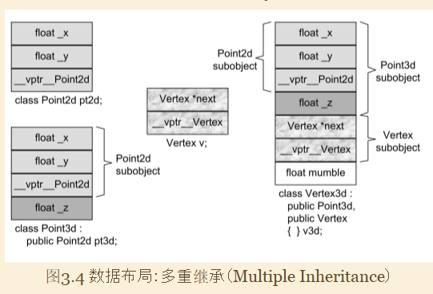

```
class Point2d {
public:
    Point2d(float x = 0.0, float y = 0.0) : _x(x), _y(y)
    {
    }
    virtual Point2d& operator+=(const Point2d& rhs)
    {
        _x += rhs._x;
        _y += rhs._y;
        return *this;
    }
    virtual float z()
    {
        return 0;
    }
    void z(float newz)
    {
    }

protected:
    float _x, _y;
};

class Point3d : public Point2d {
public:
    Point3d(float x = 0.0, float y = 0.0, float z = 0.0) : Point2d(x, y), _z(z)
    {
    }
    virtual float z()
    {
        return _z;
    }
    void z(float newz)
    {
        _z = newz;
    }
    virtual Point3d& operator+=(/*const*/ Point2d& rhs)
    {
        Point2d::operator+=(rhs);
        // blow is not right, since the parameter is const, but z() is not const
        // so either remove const parameter or add const for z()
        // _z += rhs.z();
        _z += rhs.z();
    }

protected:
    float _z;
};
```

```


/*
 * multiple inheritance
 */
class Point2d {
public:
    // ... has virtual function
protected:
    float _x, _y;
};

class Point3d : public Point2d {
public:
protected:
    float _z;
};

class Vertex {
public:
    // ... has virtual function
protected:
    Vertex* next;
};

class Vertex3d : public Point3d, public Vertex {
public:
    // ...
protected:
    float mumble;
};
```
